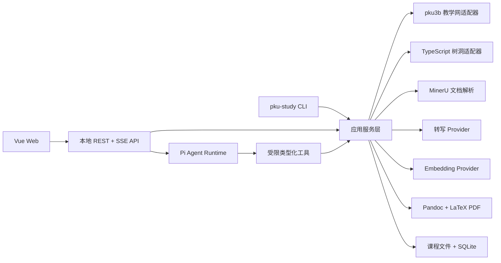

# PKU Study：基于 Pi 的文本中心学习平台实施方案

## 1. 总体设计

构建一个本地优先、单用户、跨平台的学习工作台。以课程为核心，将教学网资料、录播转写、课堂笔记、作业、自测和树洞检索统一组织起来。

首版采用：

- Node.js 22 LTS + TypeScript + pnpm workspace。
- Vue 3 + Vite 独立 Web 前端。
- TypeScript 模块化单体后端，同时提供 REST API、SSE 事件、CLI。
- 使用 [Pi SDK](https://pi.dev/docs/latest/sdk) 的 `@earendil-works/pi-coding-agent` 直接嵌入 Agent。
- SQLite 保存当前业务状态和全文索引；向量保存在 SQLite，由 TypeScript 完成课程范围内的余弦检索。
- 首先保证 Linux/WSL 可用，并通过 macOS、Windows CI 保持跨平台兼容。
- 工作名及 CLI 命令为 `pku-study`。
- 项目使用 MIT 许可证。



关键边界：

- Pi 负责理解意图、规划、检索循环、内容生成，不直接操作系统。
- 同步、下载、转写、写文件、审批、提交等由确定性应用服务完成。
- Pi 启动时设置 `noTools: "builtin"`，不暴露通用 `bash`、`write`、`edit`。
- Web、CLI、Pi 工具调用同一套应用服务，避免三套逻辑。
- 作业提交不作为 Pi 工具暴露，只能经过 Web/API/CLI 的人工审批流程。
- 本地 API 只监听 loopback，使用持久化 API token 并限制 Origin。

## 2. 参考项目与复用边界

- [AutoPku](https://github.com/WindGraham/AutoPku)：借鉴 Skill 拆分、教学网工作流和 pku3b 集成方式。
- [pku3b](https://github.com/sshwy/pku3b)：作为外部教学网执行器。首版适配当前 `0.16.x` 命令面，覆盖课程、通知、课件、作业、成绩、录播和提交。
- [pku3b_AI](https://github.com/JKay15/pku3b_AI)：借鉴统一课程内容对象、惰性 Handle/Detail、课程资源树和 Agent 工具分层；不沿用其 Python/PyO3/MCP 技术栈。
- [pku-treehole-search-agent](https://github.com/SunVapor/pku-treehole-search-agent)：借鉴多关键词搜索、帖子/评论展开和 Agent 归纳流程。
- [pku_treehole_search_skill](https://github.com/SunVapor/pku_treehole_search_skill)：借鉴树洞 CLI 工具粒度和 Skill 使用体验。
- [PKU-Art](https://github.com/zhuozhiyongde/PKU-Art)：只借鉴课件批量下载、录播下载和课程空间的功能行为。

许可证处理：

- 可直接依赖或借鉴 MIT 项目中的接口思想。
- pku3b 为 MIT，可以作为外部 CLI 依赖；不在本项目中维护其 Rust fork。
- pku3b_AI 仓库顶层没有明确 LICENSE，且内含修改过的旧版 pku3b，只作架构参考，不复制其源码。
- PKU-Art 为 GPL-3.0，只做行为层重实现，不复制代码。
- 缺少明确 LICENSE 的树洞项目只作为功能规格参考。
- 树洞客户端使用 TypeScript 独立实现，避免继承来源不明代码。

## 3. 课程模型与文件格式

### 课程生命周期

选课前使用 `CourseCandidate`：

- 课程名。
- 教师名。
- 树洞风评结论。
- 评分、置信度、检索时间和相关 PID。
- `followed` 或 `rejected` 状态。

选课后创建 `CourseWorkspace`：

- 本地 UUID `courseId`。
- 课程名、教师、学期、教学网课程 ID。
- 本地课程目录。
- 同步与提示词配置。

不再额外设计“课程本体—开课实例”双层模型。

### 课程目录

```text
<course-root>/
  course.yaml
  prompts/
    notes.md
    homework.md
    practice.md
    treehole-review.md
  materials/
    original/<section>/<folder>/
    text/
  announcements/
  recordings/
    transcripts/
  notes/
  assignments/
  practice/
```

规则：

- 原始课件 PDF 永久保留。
- 教学网栏目、文件夹和内容层级保存在 `RemoteContentNode` 元数据中；下载时尽量映射到 `materials/original/<section>/<folder>/`，不把所有附件压平到同一目录。
- MinerU 解析结果规范化为带页码标记的 Markdown；中间 JSON 不作为课程资产保留。
- 录播只长期保留带时间块的 Markdown 转写稿，视频和音频均为临时文件。
- 每次生成先写临时文件、验证、原子替换目标文件。
- 同一笔记、作业答案或命名练习集重新生成时直接覆盖，不建立版本、备份或生成审计。
- 用户主动创建的不同笔记、不同作业、不同命名练习集仍是独立资产。
- 课程目录可在不同系统间复制；SQLite、检索索引和绝对路径映射在目标机器重新构建。
- Pi 的持久化会话只用于用户命名的课程聊天；正式生成任务使用内存会话，结束后不保存推理轨迹。

## 4. 核心工作流

### 教学网同步

通过版本锁定的 pku3b 适配器实现：

- 认证状态检测和交互式初始化。
- 课程列表、通知、作业与 DDL、课件目录、录播清单同步。
- 当前成绩和已提交状态同步，用于课程概览；只保存当前状态，不建立历史曲线。
- 课件和作业附件下载。
- 录播下载。
- 作业文件提交。

同步策略：

- 启动时只做轻量元数据检查，不自动下载大文件。
- 完整课件、录播同步由用户手动触发。
- 首版支持范围为 `>=0.16.0 <0.17.0`；`doctor` 检查实际版本，超出范围时拒绝执行会产生副作用的命令。
- pku3b 目前除课表 `--raw` 外主要输出带 ANSI 样式的人类文本。适配器必须设置独立进程环境、清理 ANSI，并使用按版本维护的解析器和脱敏夹具测试；不得让 Pi 直接解析终端文本。
- 中期向 pku3b 上游贡献统一的 `--output json`；本平台检测到机器可读能力后优先使用 JSON，否则回退到对应版本解析器。
- 内部资源以 Blackboard `course_id + content_id` 等远端 ID 标识；课程序号和标题只用于展示与搜索，不能作为持久身份或提交依据。
- 同步采用“轻量列表 → 按资源取详情 → 显式下载”的惰性 Handle/Detail 模式，并限制并发；不在服务启动时获取所有课程的完整内容。
- 平台引用用户现有的 pku3b 配置和缓存位置，不复制凭据到 SQLite。
- 平台始终显式传入已配置的 `--config` 和 `--cache-dir`，并记录所用 pku3b 版本，避免 GUI 服务与用户终端读取不同环境。

### IAAA 与认证持久化

不设计“全站通用 IAAA 会话”，而是按服务维护：

- pku3b 继续负责教学网密码、Cookie、OTP 和可选系统 keyring。
- TypeScript 树洞客户端维护自己的 Cookie、Bearer token 和认证配置。
- 平台只保存认证配置文件位置和当前状态，不建立中央凭据库，也不检查外部配置的权限或安全质量。
- 认证状态统一为 `ready | needs_password | needs_otp | expired | error`。
- 任务遇到 OTP 时进入 `waiting_for_auth`，Web 请求用户输入后恢复。
- OTP 仅在内存中传递，不写日志或数据库。
- 认证失效后重新登录；不尝试绕过或自动破解二次认证。
- pku3b 会在缓存目录的 `ua.json` 中恢复并更新 Blackboard Cookie；平台通过轻量 preflight 复用该登录态。清理录播缓存时只删除 `video_download/<videoId>`，不得调用会同时删除 `ua.json` 的全局 `pku3b cache clean`。

### 文档解析与课程检索

- 默认使用本地 [MinerU](https://github.com/opendatalab/MinerU) 处理文本 PDF、扫描 PDF、表格和公式。
- 定义 `DocumentParserProvider`，为未来接入 PaddleOCR 保留替换点。
- 按页面、标题和段落切块，块记录课程、资产、页码和内容类型。
- SQLite FTS5 提供 BM25 全文检索。
- 默认使用 OpenAI Embeddings，通过 `EmbeddingProvider` 可替换。
- 语义检索限定在课程或用户指定资产范围内，采用全文与向量结果的 Reciprocal Rank Fusion。
- 索引是可重建缓存，不进入可迁移课程目录。

### 录播转写

流程为：

1. pku3b 下载录播至任务临时目录。
2. FFmpeg 提取和压缩音频。
3. 使用静音检测/VAD 分割为不超过 25 MB 的片段。
4. 使用可替换的 `TranscriptionProvider` 转写，默认采用 OpenAI 转写接口。
5. 每块加入课程术语、教师名和上一块尾部作为提示上下文。
6. 合并为 `[HH:MM:SS–HH:MM:SS] 正文` 格式的 Markdown。
7. 检查片段完整性和时间覆盖。
8. 成功后删除视频、音频、分片和 pku3b 对应视频缓存；失败时保留任务错误，但清理可安全重建的媒体缓存。

25 MB 分片和支持格式遵循 [OpenAI Speech-to-Text 指南](https://developers.openai.com/api/docs/guides/speech-to-text)。时间块以本地 VAD 分段时间为准，不承诺逐词时间戳。

### 课堂笔记

- 用户选择一份或多份课件以及对应录播转写稿。
- 系统可根据标题和日期建议对应关系，但生成前由用户确认。
- `lecture-notes` Skill 检索课件和转写稿，套用全局提示词及 `prompts/notes.md` 课程覆盖项。
- 输出结构化 Markdown：学习目标、概念、推导、课堂补充、例题、易错点、总结。
- 笔记正文不显示引用标记；内部检索块仍保留页码和时间信息用于诊断。
- 可通过 Pandoc + LaTeX/Tectonic 导出 PDF；Tectonic 不兼容时使用已安装的 TeX Live/XeLaTeX。

### 正式作业

- 导入或同步作业题目 PDF/Markdown。
- `assignment-solver` Skill 可以自由推理并使用模型一般知识，不强制只引用课程材料。
- 结果写入该作业的当前 `draft.md`，检查后导出 `answer.pdf`。
- 第一次确认冻结答案文件路径、SHA-256 和 30 分钟有效的审批记录。
- 第二次确认发生在真正调用 pku3b 提交前。
- 文件发生变化、审批过期或作业 ID 不一致时必须重新审批。
- 提交完成后删除审批记录；不保留提交审计历史。
- 自动化测试永远不执行真实提交。

### 自测练习

- 与正式作业分离，由 `practice-generator` Skill 从全部课程材料生成。
- 仅输出 Markdown/PDF，不建设网页逐题作答、自动批改或统计系统。
- 题目文件和答案解析文件分开，便于先做题再查看答案。
- 相同命名练习集重新生成时直接覆盖。

### 树洞课程风评与问答

TypeScript 树洞 Provider 提供：

- `authStatus`
- `login`
- `searchPosts`
- `getPost`
- `getComments`

Agent 根据课程名、教师名、别名和多个关键词反复检索，输出：

- 教学清晰度。
- 内容价值。
- 给分情况。
- 工作量。
- 考核可预测性。
- 每项 1–5 分、总体 1–5 分。
- 低/中/高置信度。
- 主要正面、负面观点和相关 PID。

每次调用实时访问树洞，不保存帖子正文或评论。课程风评和树洞问答只保留最终结论、检索时间和 PID，后续可按 PID 重新核验。

## 5. 公共接口、任务状态与界面

### 核心类型和 Provider

定义以下稳定接口：

- `TeachingNetworkProvider`
- `TreeholeProvider`
- `DocumentParserProvider`
- `TranscriptionProvider`
- `EmbeddingProvider`
- `PdfRenderer`
- `CourseCandidate`
- `CourseWorkspace`
- `CourseAsset`
- `RemoteContentNode`
- `RemoteResourceRef`
- `Job`
- `AuthState`
- `AssignmentApproval`

异步任务状态：

```text
queued
running
waiting_for_auth
waiting_for_review
completed
failed
cancelled
```

终态任务只保留到用户确认或服务重启，不建立长期任务历史。

### REST 与事件

主要端点：

- `/api/auth/:provider/status|login`
- `/api/candidates` 与 `/api/candidates/:id/review`
- `/api/courses` 与 `/api/courses/:id/sync`
- `/api/courses/:id/assets/import`
- `/api/courses/:id/recordings/:recordingId/transcribe`
- `/api/courses/:id/announcements/:announcementId/show`
- `/api/courses/:id/notes/generate`
- `/api/courses/:id/assignments/:assignmentId/download`
- `/api/courses/:id/assignments/:assignmentId/draft|approve|submit`
- `/api/courses/:id/practices/generate`
- `/api/timeline?range=today|week|all&limit=20`
- `/api/treehole/ask`
- `/api/sessions/:sessionId/messages`
- `/api/events`

异步操作返回 `jobId`，SSE 事件包含状态、进度、可读消息和所需人工操作。

### Pi 工具与 Skills

所有工具返回结构化 envelope：`{ ok, data?, error?, jobId?, requiresAction? }`。错误使用稳定错误码，Web 不解析自然语言来判断任务状态。

受限 Pi 工具：

- `search_course`
- `read_course_asset`
- `list_course_resources`
- `get_course_resource`
- `import_course_resource`
- `review_course_candidate`
- `save_lecture_note`
- `save_assignment_draft`
- `save_practice_set`
- `ask_treehole`
- `get_job_status`

这些工具只接受 `courseId`、`resourceId` 等受控标识。`import_course_resource` 的目标路径由课程存储服务决定，不接受 Agent 提供任意文件系统路径。

Skills：

- `course-review`
- `course-sync`
- `lecture-notes`
- `assignment-solver`
- `practice-generator`
- `treehole-qa`

提交、认证写入和任意文件写入不开放给 Pi。

### CLI

CLI 与 REST 共用服务，并默认输出 JSON：

- `pku-study doctor`
- `pku-study serve`
- `pku-study auth ...`
- `pku-study candidate add|review`
- `pku-study course list|add|sync`
- `pku-study material import|parse`
- `pku-study recording transcribe`
- `pku-study course announcement`
- `pku-study notes generate`
- `pku-study assignment download`
- `pku-study assignment draft|approve|submit`
- `pku-study practice generate`
- `pku-study treehole ask`

`doctor` 只检测并提供安装引导，不自动修改系统；检查 Node、pnpm、pku3b `0.16.x`、Python/MinerU、FFmpeg、Pandoc、Tectonic/TeX Live、模型配置和可写目录。

### Web 信息架构

- 首页提供跨课程“今日/本周”时间线，聚合未完成作业 DDL、最新公告、新资料和新录播；它只读同步状态，不自动下载或执行提交。
- 候选课程：树洞风评、评分、证据 PID。
- 课程工作区：概览、资料、录播转写、笔记、作业、自测、聊天、设置。
- 资料页同时提供“教学网资源树”和“已导入本地资产”两种视图，展示远端栏目/文件夹层级、同步状态和本地路径。
- 主编辑区以 Markdown 阅读/编辑为中心。
- 右侧可折叠 Agent 对话栏。
- 全局任务抽屉展示同步、解析、转写和生成进度。
- 人工认证、作业审批和最终提交采用明确的阻塞式确认界面。
- 只读查询工具和有副作用操作工具在 API Schema、界面样式和确认流程上明确分组；Schema 可直接生成参数表单和前端校验。

## 6. 实施顺序与验收

### 里程碑

1. ✅ 建立 pnpm monorepo、领域模型、SQLite、课程目录、REST/SSE、CLI 和 `doctor`。
2. ✅ 完成 pku3b `0.16.x` 适配、版本化解析器、认证状态机、远端课程资源树、同步和资料下载。
3. ✅ 完成 MinerU 解析、FTS5 + Embedding 混合检索。
4. ✅ 嵌入 Pi SDK，注册受限工具、Skills、课程会话和流式 Web 对话。
5. ✅ 完成 TypeScript 树洞客户端、课程风评与实时问答。
6. ✅ 完成录播下载、转写、媒体清理和课堂笔记生成。
7. ✅ 完成正式作业双确认提交、自测生成和 PDF 导出。
8. ✅ 完成 Linux/WSL、macOS、Windows 安装文档和三平台 CI。

里程碑 1 已于 2026-08-12 完成首个可运行纵切：课程工作区可由 CLI 或 Web/API 创建，生成标准文件目录与 `course.yaml`，同步写入 SQLite；本地服务具备持久 API token、REST、任务 SSE、静态 Web 托管和环境诊断。pku3b 已建立 `0.16.x` 版本门控、受限命令映射、ANSI 清理及首个课程内容解析器，完整同步仍属于里程碑 2。

里程碑 2 当前已完成课程内容的第二个可运行纵切：平台拥有独立 pku3b 配置与 Cookie 缓存目录；支持按稳定远端课程 ID 同步资料元数据、查询资源树、按资源 ID 导入受控课程目录，以及 `waiting_for_auth → OTP → resume`。OTP 不写入任务上下文、数据库或文件。由于 pku3b 0.16.x 的 `course-content list` 未输出父栏目 ID，目前资源先作为根节点保存；领域模型已保留 `parentId`，待上游 JSON/层级输出后补齐。

公告、作业、成绩、录播的概览同步与契约解析现已完成首个可运行纵切：平台使用版本化、脱敏的 `0.16.x` 输出夹具覆盖四类列表，按本地课程名过滤后写入 SQLite 当前状态；Web 课程工作区提供概览同步入口并展示四类最近记录。稳定公告 ID 现可通过 `announcement show` 读取结构化正文、发布时间和附件名称；稳定作业 ID 的题目附件现可通过 REST、CLI 和课程概览下载到固定的 `assignments/<id>/original/` 目录，并复用统一 OTP 恢复。公告附件文件本身的下载仍留待后续。

里程碑 3 已完成检索层的首个可用实现：`DocumentParserProvider` 默认提供 Markdown/纯文本解析器，并通过 `MineruDocumentParser` 适配本地 `mineru -p <input> -o <output> -b pipeline`。PDF 成功解析后只原子保留带页码标记的规范 Markdown 到 `materials/text/parsed/`，MinerU 临时输出会被清理；SQLite 使用 FTS5 保存可重建索引，并为中文等未分词查询提供课程范围 `LIKE` 回退。`EmbeddingProvider` 默认通过配置了 `OPENAI_API_KEY` 时的 OpenAI `text-embedding-3-small` 生成向量，向量仅作为 SQLite 可重建缓存保存；全文与语义结果采用 RRF 融合。Embedding 未配置或暂时失败时自动退回全文检索。REST 提供 `/documents/index`、`/documents/rebuild` 与 `/documents/search`，CLI 提供 `course index`、`course reindex` 与 `course search`；批量重建只扫描课程约定的文本目录并跳过原始资料。

课程工作区现已接入资料检索界面：支持关键词搜索、显示来源文件和文本块、空结果/错误/加载状态，以及一键重建课程索引。检索仍限定在当前课程范围内，不读取课程目录之外的文件。

里程碑 4 已完成受限 Agent 纵切：Pi SDK 使用 `noTools: "builtin"`、显式工具白名单和禁用外部扩展/上下文加载器启动；会话只注册课程检索、已索引资产读取、教学网资源查询/导入、笔记/草稿/练习的固定目录写入及课程任务查询。工具不接受任意文件路径，生成 Markdown 通过课程存储服务原子落盘后立即重建对应索引；不注册 shell、通用读写、认证、OTP 或作业提交。`course-sync`、`lecture-notes`、`assignment-solver` 与 `practice-generator` 已作为应用内置、显式触发的 Pi Skills 写入受控配置目录，加载器只接受这些精确路径，拒绝项目、用户目录和命令行启用的外部 Skills。服务端支持创建内存课程会话、可选命名 JSONL 持久会话、会话列表/恢复、仅投影用户/助手文本的历史读取、SSE 文本增量与工具状态、显式关闭；Web 课程工作区提供可关闭的右侧助手面板、可选会话名称和命名会话恢复选择。

里程碑 5 已完成候选课程与树洞检索的首个可用纵切：SQLite 只保存候选课程元数据、最终 1–5 评分结论、置信度、摘要和 PID；树洞帖子与评论只作为单次 API、CLI 或内存 Agent 会话的实时证据，绝不写入 SQLite、课程目录或命名 Pi JSONL。`TreeholeProvider` 定义认证状态、登录、关键词检索、帖子和评论查询契约；默认 HTTP 适配器支持 PKU OAuth → Treehole SSO → 会话探测，并在服务明确要求时用本次提交的手机令牌或短信验证码继续认证。用户名、密码、验证码和 Bearer 会话只在本地服务进程与 Web 表单内存中存在，不写入文件、SQLite 或命名会话；也可用 `PKU_STUDY_TREEHOLE_AUTHORIZATION` 注入已有会话。REST 已提供候选课程创建、状态更新、实时证据收集、显式保存结论、树洞问答和认证状态接口，CLI 提供 `candidate` 与 `treehole status|ask`，Web 首页提供候选课程创建、状态切换、认证、实时证据视图和人工归纳表单；只有用户显式保存的评分、摘要、正负面观点和 PID 会进入候选记录。`course-review`、`treehole-qa` 及其 Agent 工具仅在内存会话中加载，命名会话会自动排除它们，防止实时原文进入 JSONL。真实树洞协议与认证流程仍需人工冒烟验证。

里程碑 6 已完成录播转写与课堂笔记的首个可用纵切：录播必须先由概览同步写入稳定远端 ID，随后由 `pku3b video download` 下载至按任务隔离的缓存目录。`FfmpegAudioProcessor` 通过 `silencedetect` 优先在静音处切分，并以单声道 24 kbps Opus/WebM 导出不超过 24 MiB 的片段；每个片段先校验路径、大小和时间范围。`TranscriptionProvider` 默认使用 OpenAI 文件转写接口和 `gpt-transcribe`，可通过环境变量或应用选项替换；课程名、教师、录播标题、术语及上一片段尾部只作为本次请求上下文，不进入任务持久化状态。成功后只原子保留并索引 `recordings/transcripts/*.md` 中的 `[HH:MM:SS–HH:MM:SS]` 时间块，任务目录、原视频、音频片段及对应 `pku3b/video_download/<videoId>` 缓存都会清理，同时保留 `ua.json`。REST 提供录播转写任务入口，CLI 提供 `recording transcribe`，Web 工作区已提供录播清单和转写操作；OTP 继续只在内存中传递并可经统一恢复端点重试。课程工作区通过 `/note-sources` 提供已索引课件和录播稿的候选列表，用户多选后会创建临时专用的 `lecture-notes` 会话：只注册已确认路径的读取工具与笔记保存工具，并且只加载该 Skill，模型生成完成后仍由受控目录服务原子保存和索引笔记。

里程碑 7 已完成正式作业安全流程的首个可用纵切：稳定作业 ID 的题目附件可通过 pku3b 下载到固定的 `assignments/<id>/original/`，下载目录由任务临时目录校验后原子切换，调用方不能指定任意输出路径；REST、CLI 和课程概览 Web 操作均支持下载及统一 OTP 恢复。受控 PDF 导出只读取课程目录中稳定作业 ID 对应的 `assignments/<id>/draft.md`，通过 Pandoc/LaTeX 渲染并原子生成 `answer.pdf`。提交前必须单独创建 30 分钟审批记录，记录绑定课程、远端作业 ID、固定答案路径和 SHA-256；文件变化、审批过期、路径不匹配或作业 ID 不稳定都会阻止提交。提交任务通过 pku3b 的 `assignment submit`，OTP 进入 `waiting_for_auth` 后可经统一恢复端点继续，成功后删除审批记录；Pi 不暴露提交工具。自动测试只使用替身 pku3b，真实提交仍仅允许人工冒烟验证。自测生成继续复用受限 `practice-generator` Skill；Web 现已提供独立题目/答案阅读工作台，REST 与 CLI 的 `practice list|show` 只枚举并读取课程 `practice/` 中完整的固定 Markdown 文件对，不开放任意路径读取。

里程碑 8 已补齐 Linux/WSL、macOS 与 Windows 的安装和外部依赖说明，并新增 GitHub Actions 三平台矩阵，在 Node.js 22 和 pnpm 10 下执行依赖安装、类型检查、单元测试与生产构建。各平台真实教学网认证、外部媒体工具与 PDF 引擎仍需人工冒烟验证。

### 测试与验收场景

- 单元测试：课程路径与层级映射、原子覆盖、pku3b 各命令 ANSI/无 ANSI 输出解析、RRF 排序、认证状态机、审批哈希失效。
- pku3b 契约测试：保存 `0.16.x` 的课程内容、公告列表/详情、作业、录播、成绩和错误输出脱敏夹具；验证远端 ID 不依赖课程序号或标题。
- Provider 契约测试：使用固定夹具模拟 pku3b、树洞 OAuth/SSO/验证码会话、MinerU、转写和 Embedding。
- 集成测试：从模拟课程同步到课件解析、检索、笔记生成的完整链路。
- 录播测试：分片失败可重试；全部成功后媒体被删除；转写稿时间块连续。
- 作业测试：稳定作业 ID 的附件只写入固定目录；下载结果为空或包含符号链接时拒绝切换；重复下载复用已校验目录；未审批不能提交；文件改动、审批过期、作业 ID 不一致均阻止提交。
- 隐私测试：SQLite 和课程目录中不存在树洞正文、评论、OTP、录播视频或音频。
- 时间线测试：跨课程只读聚合作业、公告、录播、成绩和已同步资料，并按今日/本周窗口与数量上限筛选。
- Pi 测试：Agent 无法调用 shell、通用写文件或作业提交。
- 跨平台 CI：Ubuntu、Windows、macOS 上执行构建、单元测试和路径测试。
- 不使用 Playwright；Web 使用 Vitest、Vue Test Utils 和 API 集成测试。
- 真实教学网与树洞测试只做 [受控人工冒烟](docs/SMOKE_TEST.md)：登录、列表、下载、转写与会话内存边界；真实作业提交永不进入自动测试。
- 缓存测试：录播清理只移除目标视频分片，保留 pku3b 的 `ua.json` 和其他任务缓存。

### 明确假设

- 首版为本地单用户平台，不做账号系统、云端部署、跨设备同步和多人协作。
- Windows 首选 WSL 路径，但核心代码同时支持原生 Windows、macOS 和 Linux。
- 不自动安装外部依赖，只做诊断和引导。
- 默认 OpenAI 用于转写和 Embedding，但所有模型与 Provider 可替换。
- 树洞接口属于易变化的非正式接口，变化被限制在 `TreeholeProvider` 内。
- 只保留用户可见的当前成果和命名聊天，不建设版本、生成记录或操作审计系统。
- pku3b_AI 的 MCP/Python 层不进入运行时依赖；若未来需要兼容其他 Agent 客户端，可在同一应用服务之上增加独立 MCP facade。

## 7. pku3b 源码复核后的设计决策

- 采用 pku3b 的配置覆盖、缓存覆盖、Cookie 恢复、OTP 参数、稳定课程内容组合 ID、断点续传和原子分片写入。
- 采用 pku3b_AI 的统一内容分类、栏目/文件夹资源树、轻量 Handle 与按需 Detail 思想。
- 不采用 pku3b_AI 的课程序号/标题寻址、启动时全量登录与加载、字符串拼接工具返回、任意下载目录、Agent 直接提交和全局内存 registry。
- pku3b 上游当前 Rust API 不是公开库接口，因此首版继续使用进程边界；机器可读 JSON 是降低长期维护成本的优先上游协作项。
- 详细依据见 [`reference/PKU3B_REVIEW.md`](reference/PKU3B_REVIEW.md)。
